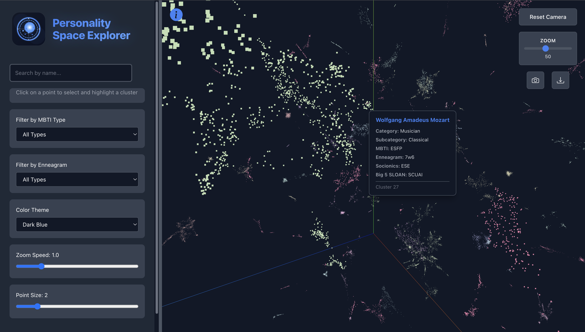
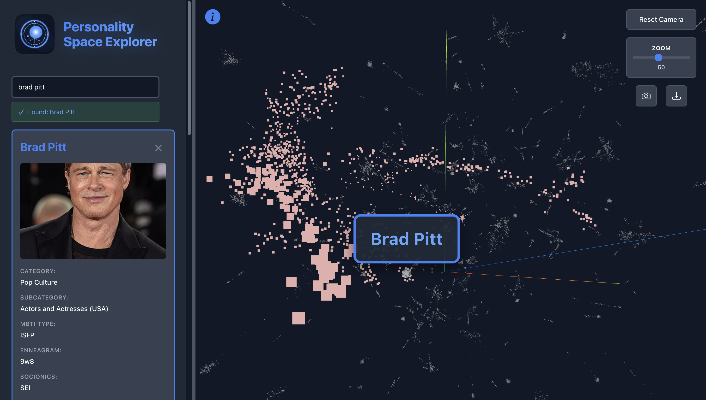

# Personality Space Explorer

This is a personality space explorer on the web that is meant for discovering patterns and similarities of various personalities based on 50k+ records of celebrity personality data. The dataset used in this project is from kaggle.com and is called MBTI Celebrity Personality Types.

## Live Demo

**Web Application**: [https://personality-space-explorer.vercel.app/](https://personality-space-explorer.vercel.app/)

## Screenshots




## Overview

The Personality Space Explorer visualizes over 50,000 celebrity personalities in an interactive 3D space. Celebrities are positioned based on their personality traits (MBTI types and Enneagram), with similar personalities clustered together. The visualization uses dimensionality reduction techniques to map high-dimensional personality data into 3D coordinates.

## Features

- **3D Interactive Visualization**: Explore 50,878 celebrities in a navigable 3D space using Three.js
- **Search**: Find specific celebrities by name
- **Filters**: Filter by MBTI type and Enneagram type
- **Cluster Analysis**: View and select personality clusters with auto-generated labels and descriptions
- **Celebrity Details**: Click on any point to see detailed personality information
- **Camera Controls**:
  - Rotate: Left-click and drag
  - Zoom: Scroll wheel
  - Pan: Right-click and drag
- **Customization**: Adjust point size, zoom sensitivity, and visual settings

## Project Structure

```
personality-space-explorer/
├── apps/
│   └── web/              # React + Vite web application
├── scripts/
│   └── data_pipeline.py  # Data processing and clustering
├── artifacts/            # Generated data files (Parquet)
└── thumbnails/          # Screenshot images

```

## Technology Stack

### Web Application
- **React** - UI framework
- **Three.js** - 3D rendering
- **react-three-fiber** - React renderer for Three.js
- **Vite** - Build tool and dev server

### Data Pipeline
- **Python** - Data processing
- **Pandas** - Data manipulation
- **scikit-learn** - Dimensionality reduction (UMAP/PCA)
- **HDBSCAN** - Clustering algorithm
- **Claude API** - Cluster labeling and description generation
- **Apache Parquet** - Efficient data storage format

## Getting Started

### Prerequisites

- Node.js 18+
- Python 3.9+
- npm or yarn

### Web Application Setup

1. Install dependencies:
```bash
cd apps/web
npm install
```

2. Start the development server:
```bash
npm run dev
```

3. Build for production:
```bash
npm run build
```

### Data Pipeline

The data pipeline processes raw celebrity personality data and generates the 3D visualization coordinates:

1. Install Python dependencies:
```bash
pip install pandas numpy scikit-learn umap-learn hdbscan pyarrow anthropic
```

2. Set up Claude API key:
```bash
export ANTHROPIC_API_KEY=your_api_key_here
```

3. Run the pipeline:
```bash
python scripts/data_pipeline.py
```

This will:
- Load the celebrity personality dataset
- Apply dimensionality reduction (UMAP) to create 3D coordinates
- Cluster similar personalities using HDBSCAN
- Generate cluster labels and descriptions using Claude AI
- Save results to Parquet files in `artifacts/`

## Data Format

The pipeline generates the following files in `artifacts/`:

- `embedding.parquet` - 3D coordinates (x, y, z) for each celebrity
- `clusters.parquet` - Cluster assignment for each celebrity
- `metadata.parquet` - Celebrity information (name, MBTI, Enneagram, etc.)
- `cluster_metadata.json` - Cluster labels and descriptions

## Deployment

The web application is deployed on Vercel. To deploy your own instance:

1. Install Vercel CLI:
```bash
npm i -g vercel
```

2. Deploy:
```bash
cd apps/web
vercel
```

## Dataset

The project uses the "MBTI Celebrity Personality Types" dataset from Kaggle, containing personality type information for over 50,000 celebrities including:
- MBTI type (16 personality types)
- Enneagram type (Types 1-9)
- Celebrity name
- Additional metadata

## License

MIT

## Acknowledgments

- Dataset: MBTI Celebrity Personality Types (Kaggle)
- Dimensionality Reduction: UMAP algorithm
- Clustering: HDBSCAN algorithm
- AI-Generated Descriptions: Claude API by Anthropic
